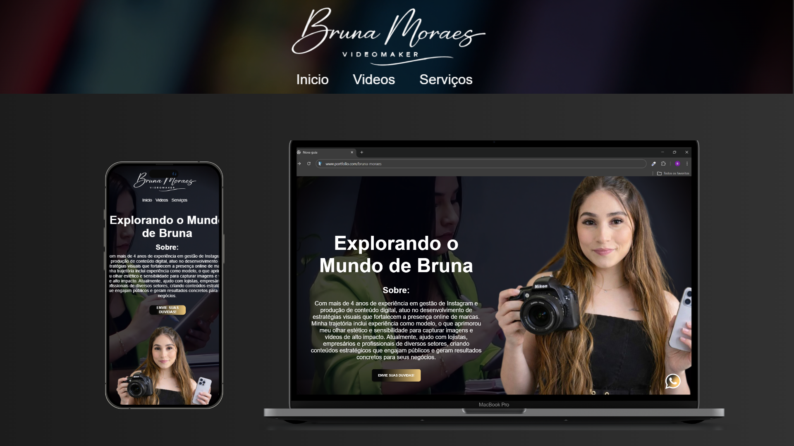
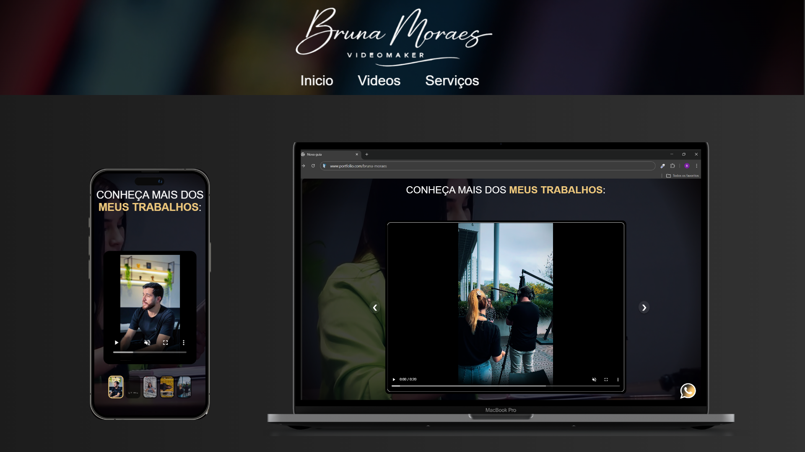
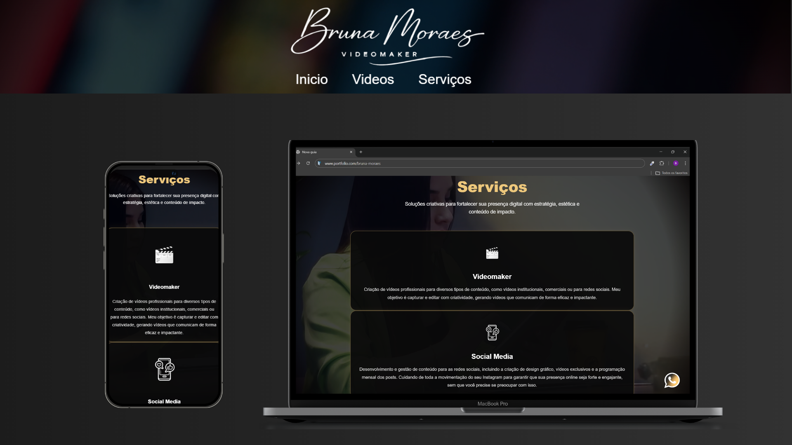
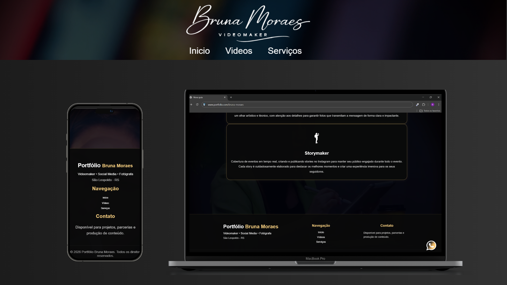

# Portfólio de Bruna Moraes

Este é o portfólio desenvolvido para a Bruna Moraes, uma profissional com foco em videomaker, social media e fotógrafa. O projeto foi criado para apresentar suas habilidades, serviços e mostrar seu trabalho de forma impactante e funcional. O design é responsivo, adaptando-se tanto para visualização em desktop quanto em dispositivos móveis.

## Estrutura do Projeto

O portfólio foi dividido em várias páginas, cada uma com uma função específica, proporcionando uma navegação clara e objetiva. Abaixo, você pode ver uma descrição de cada página, com capturas de tela para ilustrar.

### 1. Página Inicial

A página inicial apresenta uma introdução à Bruna Moraes, destacando sua experiência de mais de 4 anos em gestão de Instagram e criação de conteúdo digital.

- **Imagens**:  
    
    - A primeira imagem mostra a apresentação da Bruna com uma breve descrição sobre seu trabalho.

- **Características**:
  - Apresentação pessoal.
  - Botões de navegação para acessar outras páginas do portfólio.

### 2. Página de Trabalhos

Esta página apresenta uma coleção dos trabalhos da Bruna, com vídeos destacados que exemplificam sua capacidade criativa como videomaker.

- **Imagens**:  
    
    - Exemplo de vídeo que pode ser assistido diretamente da página.

- **Características**:
  - Galeria de vídeos.
  - Navegação interativa para visualizar diferentes tipos de trabalhos.

### 3. Página de Serviços

Na página de serviços, são descritos os principais serviços oferecidos por Bruna, como videomaker e social media.

- **Imagens**:  
    
    - Destaque para os serviços de criação de vídeos e gestão de redes sociais.

- **Características**:
  - Descrição detalhada de cada serviço.
  - Ícones interativos para uma navegação mais fluida.

### 4. Footer

O footer contém informações adicionais sobre o portfólio e formas de contato. Ele inclui links rápidos para navegação e dados de copyright.

- **Imagens**:  
    
    - Exibe os detalhes sobre o rodapé do site com links de navegação e informações de contato.

---

## Tecnologias Usadas

O portfólio foi desenvolvido utilizando as seguintes tecnologias:
<div style="text-align: center;"></div>


## Como Rodar o Projeto

1. Clone o repositório:
   ```bash
   git clone https://github.com/brndenh/portfolio-bruna-moraes.git

   Contribuições

Sinta-se à vontade para contribuir com o projeto! Abra uma "pull request" se tiver sugestões de melhorias ou correções.
